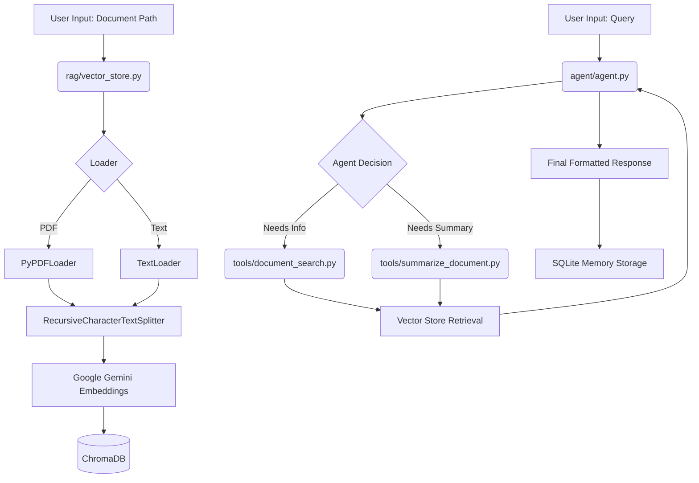

# Document Analysis Agent: Project Workflow & Documentation

This document provides a comprehensive overview of the **Document Analysis Agent** project. It details the system architecture, operational workflow, and the specific role of each file within the repository.

---

## 1. Project Overview
The **Document Analysis Agent** is a RAG (Retrieval-Augmented Generation) based system designed to ingest documents (PDF or Text), index them into a vector database, and provide an intelligent assistant capable of answering questions, summarizing content, and providing suggestions based strictly on the provided document.

---

## 2. Core Architecture & Workflow

The system follows a standard RAG pattern enhanced with an agentic loop:



### Operational Steps:
1.  **Ingestion & Indexing**: The user provides a file path. The system loads the document, splits it into chunks, generates embeddings using Gemini, and stores them in ChromaDB.
2.  **User Query**: The user asks a question via the CLI.
3.  **Agentic Reasoning**: The LangGraph ReAct agent (powered by Gemini Flash) decides whether it needs to query the document using available tools.
4.  **Tool Execution**:
    *   `search_document`: Fetches specific context for targeted questions.
    *   `summarize_document`: Fetches a broader set of context for general overviews.
5.  **Synthesis**: The agent combines the retrieved context with the user's query and any previous conversation history (from SQLite memory) to generate a response.
6.  **Persistence**: The conversation history is saved for multi-turn dialogue support.

---

## 3. Detailed File-by-File Analysis

### Root Directory
*   **`.env`**: Stores sensitive API keys (e.g., `GOOGLE_API_KEY`).
*   **`requirements.txt`**: Lists all Python dependencies (`langchain`, `langgraph`, `google-generativeai`, `chromadb`, etc.).
*   **`memory.sqlite`**: A persistent database used by LangGraph to store conversation checkpoints, allowing the agent to remember context across restarts.

### `app/` - Application Layer
*   **`main.py`**: The entry point of the application. 
    *   Contains the ASCII interface.
    *   Handles initial document setup via `vector_store.py`.
    *   Manages the interactive chat loop and error handling.

### `agent/` - Intelligence Layer
*   **`agent.py`**: The "brain" of the project.
    *   Initializes the `ChatGoogleGenerativeAI` (Gemini Flash) model.
    *   Connects the agent to the SQLite memory for persistence.
    *   Configures the `create_react_agent` with tools and the system prompt.
    *   Contains a post-processing function `run_agent` to clean up structured JSON/List outputs into human-readable text.

### `rag/` - Knowledge Retrieval Layer
*   **`vector_store.py`**: Manages document processing.
    *   **Loaders**: Uses `PyPDFLoader` for PDFs and `TextLoader` for others.
    *   **Splitter**: Uses `RecursiveCharacterTextSplitter` with 1000-character chunks and 200-character overlap.
    *   **Embeddings**: Uses `models/gemini-embedding-001`.
    *   **Vector DB**: Initializes and resets `ChromaDB` for each session.

### `tools/` - Capability Layer
*   **`document_search.py`**: Defines the `search_document` tool.
    *   Invokes the retriever to get the top 3 most relevant chunks for a specific query.
*   **`summarize_document.py`**: Defines the `summarize_document` tool.
    *   Optimized for broad queries (e.g., "what is this about?"). It attempts to fetch up to 10 chunks to provide a more holistic view to the agent.

### `configs/` - Configuration Layer
*   **`system_prompt.txt`**: The instruction set for the agent. It strictly forbids "hallucinations" and mandates tool usage for document-related queries.
*   **`tools_config.py`**: A central registry that exports the list of tools available to the LangGraph agent.

---

## 4. Technology Stack
*   **LLM**: Google Gemini 1.5 Flash (Fast and efficient reasoning).
*   **Embeddings**: Google Gemini Embedding-001.
*   **Orchestration**: LangGraph (Stateful, agentic workflows).
*   **Vector Store**: ChromaDB (Local vector storage).
*   **Database**: SQLite (Conversation memory persistence).
*   **Loading/Chunking**: LangChain Community Loaders & Splitters.

---

## 5. How to Run
1.  Ensure you have a `.env` file with your `GOOGLE_API_KEY`.
2.  Install dependencies: `pip install -r requirements.txt`.
3.  Run the application:
    ```bash
    python app/main.py
    ```
4.  Provide the path to a PDF or TXT file when prompted.
